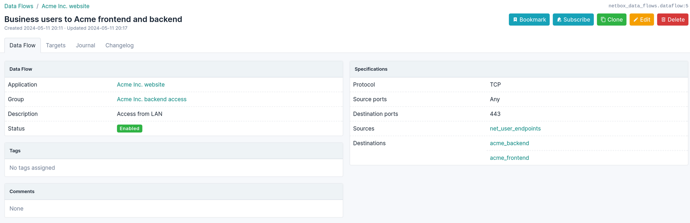

# NetBox Data Flows Plugin

NetBox plugin to document Data Flows between devices and applications.

## Features

* Document data flows between IP addresses, IP ranges and Prefixes documented in NetBox.
* Regroup the data flows into applications and hierarchical groups.

Documenting your data flows can help you design the network architecture, automate your firewall rule definition or reviews, implement security contracts in a software-defined network, or respond to compliance requirements.

## Screenshots

### Data Flow

A data flow for an application, here representing the user access to frontend servers and backend servers over TCP/443.

Details of the data flow specifications, displaying all the IP addresses, IP ranges and Prefixes that are involved in that data flow.

### Application

The application allows you to group all the related data flows. Optionally, you can assign devices or other NetBox objects to an application, using a custom field.

### Device tab views

The plugin adds Tab views to Devices, Virtual Machines, IP addresses, IP ranges and Prefixes to list all the data flows that involve them as a source or destination.

## Getting started

Read the [Quick Start tutorial](https://alef-burzmali.github.io/netbox-data-flows/quick-start/) to discover how to use the plugin.

## Data model

The data model and design's decisions can be found in the [documentation](https://alef-burzmali.github.io/netbox-data-flows/data-model/).

## Installation and configuration

Instructions to install, configure, update or uninstall the plugin can be found in the [plugin's documentation](https://alef-burzmali.github.io/netbox-data-flows/installation-configuration/).

### Supported Versions

| netbox version | netbox-data-flows version     |
| -------------- | ----------------------------- |
| >= 4.5.0       | >= v1.4.1                     |
| >= 4.4.0       | >= v1.2.1, < v1.5.0           |
| >= 4.3.0       | >= v1.1.1, < v1.5.0           |

[Older versions](https://alef-burzmali.github.io/netbox-data-flows/installation-configuration/#installation-and-configuration)

Only the latest version of the plugin is officially supported. The test suite is run on the latest patch version of the current version of NetBox, and the previous one (if no breaking compatibility change).

### Dependencies

* NetBox
* Python 3.12 or higher

## Contributions

Contributions are welcomed. This plugin is developped on the free time of its author, so do not expect regular releases.

Please report security vulnerabilities via [GitHub security advisory](https://github.com/Alef-Burzmali/netbox-data-flows/security). Do not create a public issue. See also the [Security Policy](https://github.com/Alef-Burzmali/blob/main/SECURITY.md).

Please report bugs and feature requests in GitHub.

[GitHub Discussions](https://github.com/Alef-Burzmali/netbox-data-flows/discussions) are opened for general help requests and any other topics you may want to discuss.

### Known bugs and limitations

* GraphQL API is not implemented

See also the [list of issues](https://github.com/Alef-Burzmali/netbox-data-flows/issues).
