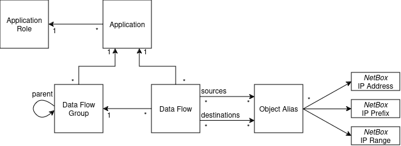

# Data Model and Design's Decisions

If you want an example on how to use the plugin, head towards the [quick start tutorial](quick-start.md).

## Plugin's objectives

The goal of this plugin is to document the data flows of applications and systems, which should already be documented in your NetBox instance.

It aims to:

* Document known TCP, UDP, ICMP or SCTP data flows
* Group them and link them to applications for better manageability
* Provide a useful source of truth to generate firewall or other filtering rules (network ACL, security contracts, etc.)

It does not try to:

* Document the existing firewall or network filtering rules
* Provision firewall or filtering rules (still possible via scripts)

## Design considerations

The plugin tries to use the native NetBox objects when relevant. However, data flows are not directly between physical devices or virtual machines, instead they sit at a higher application level and are relatively agnostic of the physical world under them.

Furthermore, a device may have several network interfaces, each with zero, one or several IP addresses. An application may be configured to use a specific IP address to sent a data flow from, or to listen on or it can use any available IP address and let the operating system figure which one is used.

For some data flows, it does not make sense to specify single IP addresses as source or as destination. For example, all the devices in a network segment may want to connect to the same DNS or LDAP servers. Or a monitoring server may scan entire network ranges.

As such, it was decided to use NetBox's **IP Address**, **IP Range** and **IP Prefix** objects as the sources and destinations of data flows:

* If the source is a single IP of a single device, you can use the IP Address assigned to that device.
* If the source is any IP of a device, you can list all the IP addresses assigned to that device.
* If the destination is a whole Prefix or IP Range, you can use that object.
* If the destination is a specific set of IP Addresses, you can list them explicitely.

It was decided not to use the native **Service** object:

* The Service represents a TCP, SCTP or UDP listener and does not work as a possible Source for the data flow
* It does not support other protocols, such as ICMP
* It is easy to combine a list of IP, prefixes and ranges, but combining them with a service (i.e.: a IP/protocol/port association) is much more complicated
* Trying to bypass these limitations led to a technical implementation that was too complex and error-prone.

To ease maintenance, the IP Addresses, IP Ranges and Prefixes are grouped in Object Aliases. These can be seen as reusable groups of addresses that can be a source or a destination to one or several data flows.

## Data Model

The following sections explain the different objects created by the plugin.

### Application and Application Role

**Applications** are logical grouping of data flows and can be business
applications or infrastructure.

Examples of applications:

* Active Directory
* MySuperBusinessApp
* Network management
* ...

You can optionally use a custom field to assign your devices and other object to specific applications.
See the Options section of [the configuration guide](installation-configuration.md#options)

**Application Role** is a label to help you categorize your applications.
Each Application may have one Application Role.

Examples of roles:

* Infrastructure
* Business Division 1
* ...

### Data Flow

**Data Flows** modelize a network connection between two objects. They may be assigned to an Application.

Data Flows should have a source, a destination, a protocol, source ports and destination ports. Only the protocol is mandatory.

By convention, if the list of source ports or destination ports is empty, this means "Any" port is accepted (for transport protocols with ports). The interface will display `Any`. API and exports will return an empty list.

**Data Flow Groups** form a forest of groups. They can also be assigned to an Application. Data Flow Groups can be enabled and disabled and inherit the status of their parent. Disabled Data Flow Groups disable all the Data Flows contained within.

Only in the REST API, the inherited list of tags is available (inherited_tags when reading and inherited_tag when filtering). This is the set of tags of the data flow and its parent groups. This field is not displyed in the UI.

### Object Alias

**Object Aliases** are a group of references to other NetBox objects. Object Aliases are used as sources and destinations of Data Flows and corresponds to the groups or aliases used in firewall configuration.

Object Aliases can contain any number of:

* IP Addresses (`ipam.ipaddress`)
* IP Ranges (`ipam.iprange`)
* Prefixes (`ipam.prefix`)

There is no defined meaning for an empty object alias, but it can be used when:
* The aliased object is not documented in NetBox (e.g.: third party public IP addresses)
* The alias is "Any" / "Internet" destination
