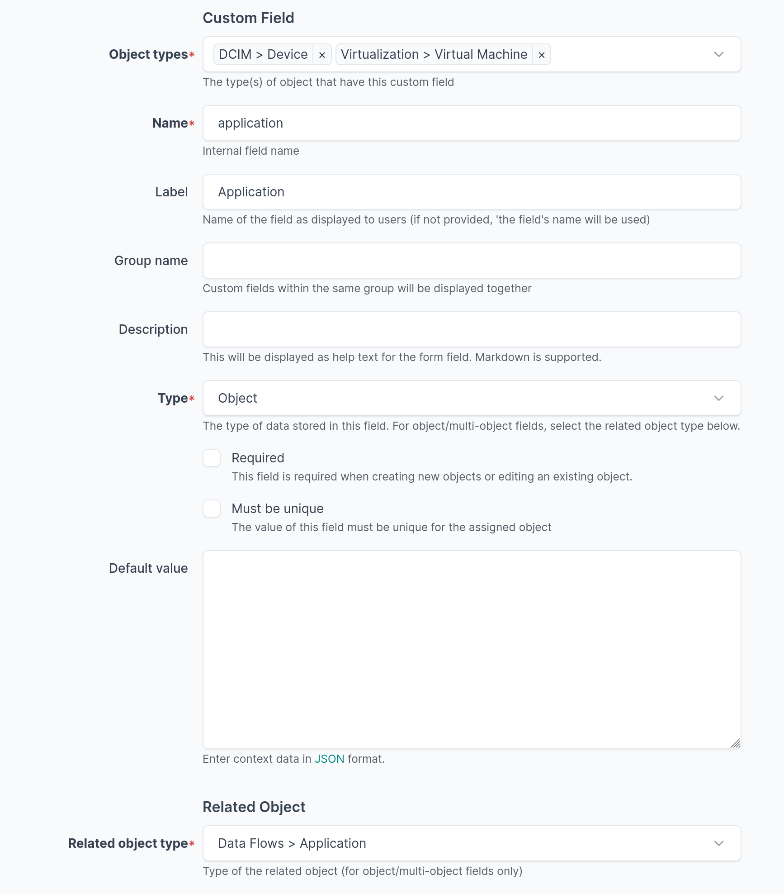

# Installation and Configuration

## How to install

NetBox Data Flows is a [NetBox](https://github.com/netbox-community/netbox) plugin.

Once installed, go to the [quick start guide](quick-start.md) to discover how to use the plugin.

### Supported Versions

| netbox version | netbox-data-flows version     |
| -------------- | ----------------------------- |
| >= 4.5.0       | >= v1.4.1                     |
| >= 4.4.0       | >= v1.2.1, < v1.5.0           |
| >= 4.3.0       | >= v1.1.1, < v1.5.0           |
| >= 4.2.0       | >= v1.1.0, < v1.4.0           |
| >= 4.1.0       | >= v1.0.4, < v1.2.0           |
| >= 4.0.0       | >= v0.9.0, < v1.2.0           |
| >= 3.7.0       | >= v0.8.0, < v0.9.0           |
| >= 3.6.0       | >= v0.7.3, < v0.8.0           |
|  < 3.6.0       | Not supported                 |

Only the latest version of the plugin is officially supported. The test suite is run on the latest patch version of the current version of NetBox, and the previous minor one (if no breaking compatibility change).

> [!WARNING]
> The plugin uses some classes that are not explicitely exported in
NetBox's plugin API, such as MPTT Tree-based models. Upward compatiblity is therefore not fully guaranteed.

### Dependencies

* NetBox
* Python 3.12 or higher

### Installation

> [!NOTE]
> For adding to a NetBox Docker setup see
[the general instructions for using netbox-docker with plugins](https://github.com/netbox-community/netbox-docker/wiki/Using-Netbox-Plugins).

The plugin is available at [PyPi](https://pypi.org/project/netbox-data-flows/).

Add the Python package to your `local_requirements` file:
```bash
echo netbox-data-flows >> /opt/netbox/local_requirements.txt
```

Enable the plugin in NetBox configuration:
```python
# Add in: /opt/netbox/netbox/netbox/configuration.py

PLUGINS = [
  'netbox_data_flows',
]
```

Run NetBox's `upgrade.sh` script to download the plugin and run the migrations:
```bash
/opt/netbox/upgrade.sh
```

Full reference: [Using Plugins - NetBox Documentation](https://docs.netbox.dev/en/stable/plugins/).

### Upgrade

The latest version from PyPi is always installed when `upgrade.sh` is run again, thus the plugin will be updated when you update your NetBox instance.

You can manually update the plugin without upgrading NetBox with:
```bash
# Enter NetBox venv
. /opt/netbox/venv/bin/activate

# Update the plugin
pip install --upgrade netbox-data-flows

# Run the migrations
/opt/netbox/netbox/manage.py migrate netbox_data_flows

# Restart the NetBox server
systemctl restart netbox.service netbox-rq.service
```

### Uninstallation

Disable the plugin in NetBox configuration: remove `netbox_data_flows` from `PLUGINS`.

Remove `netbox-data-flows` from your `local_requirements` file. You can run `upgrade.sh` or enter the venv and use `pip` to uninstall `netbox-data-flows`.

Deleting the data of the plugin is not recommended. If you really want to do it:

* Enable the venv and launch NetBox's dbshell
* Drop all the `netbox_data_flows_*` tables, e.g.:
  `DROP TABLE netbox_data_flows_applicationrole CASCADE`)
* Delete the migrations of the plugin:
  `DELETE FROM "django_migrations" where "app" = 'netbox_data_flows';`


## Configuration

The plugin can be configured in NetBox's `configuration.py` file.

### Options

You can configure the plugin by changing `PLUGIN_CONFIG`:

```python
# Add in: /opt/netbox/netbox/netbox/configuration.py

PLUGINS_CONFIG = {
    'netbox_data_flows': {
        # Create a menu section for the plugin
        'top_level_menu': True,
        # Use a Custom Field to identify objects linked to an application
        'application_custom_field': "application",
    }
}
```

Supported options:

* `top_level_menu`: if set to `True` (default), the plugin will create its own menu section in the left navigation panel. If set to `False`, the plugin will be in a subsection under the `Plugins` section.
* `application_custom_field` (disabled by default): when set to the name of a custom field, will display a list of related objects in the application page. The custom field must exist, be of type Object or Multiple Object and be related to `Data Flows > Application`.



### Nomenclature

The name of Data Flows, Data Flow Groups and Object Aliases is not
constrained. You may wish to enforce your own validation rules in your
configuration, e.g.:

```python
# Add in: /opt/netbox/netbox/netbox/configuration.py

CUSTOM_VALIDATORS = {
    "netbox_data_flows.objectalias": [
        {
            "name": {
                "regex": "(host|net)_[a-z_]+"
            },
        }
    ]
}
```

Similar settings can be applied to:

* Applications: `netbox_data_flows.application`
* Application Roles: `netbox_data_flows.applicationrole`
* Data Flows: `netbox_data_flows.dataflow`
* Data Flow Groups: `netbox_data_flows.dataflowgroup`
* Object Aliases: `netbox_data_flows.objectalias`

Full reference: [CUSTOM_VALIDATORS - NetBox Documentation](https://docs.netbox.dev/en/stable/configuration/data-validation/#custom_validators)

### Protocol Choices

You can edit the list of available protocols when creating a data flow.

```python
# Add in: /opt/netbox/netbox/netbox/configuration.py

FIELD_CHOICES = {
    'netbox_data_flows.DataFlow.protocol+': (
        ('igmp', "IGMP"),
    )
}
```

This syntax will add IGMP as a possible protocol in the drop list.

You can also extend the list of:

* ICMPv4 types: `netbox_data_flows.DataFlow.icmpv4types+`
* ICMPv6 types: `netbox_data_flows.DataFlow.icmpv6types+`

Full reference: [FIELD_CHOICES - NetBox Documentation](https://docs.netbox.dev/en/stable/configuration/data-validation/#field_choices)
