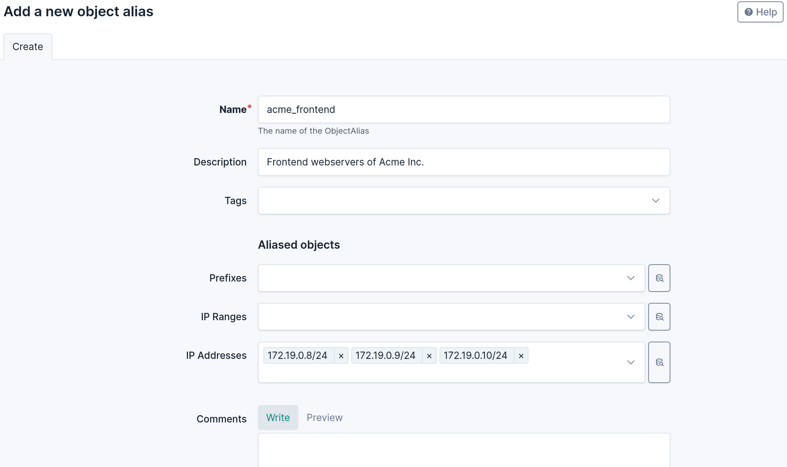
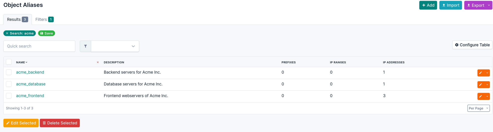
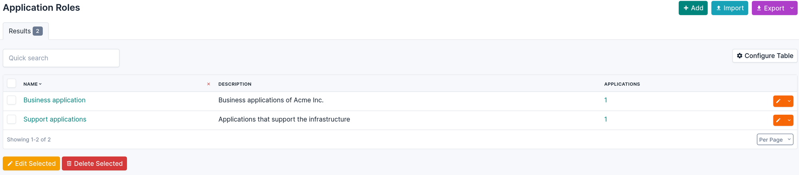
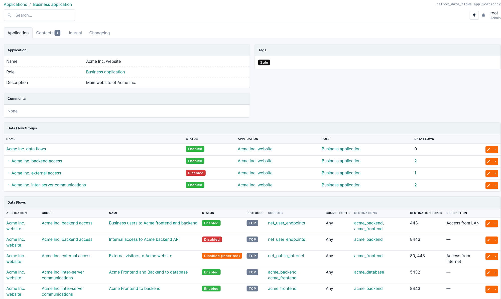
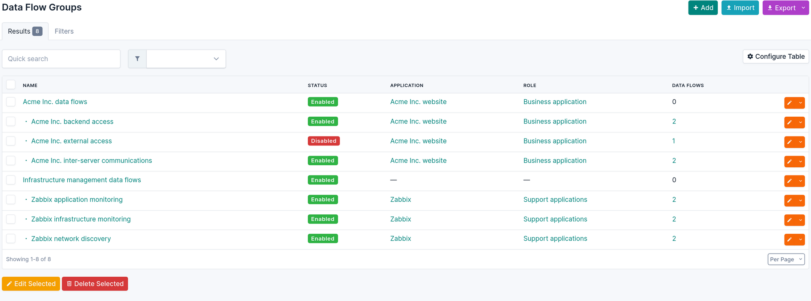
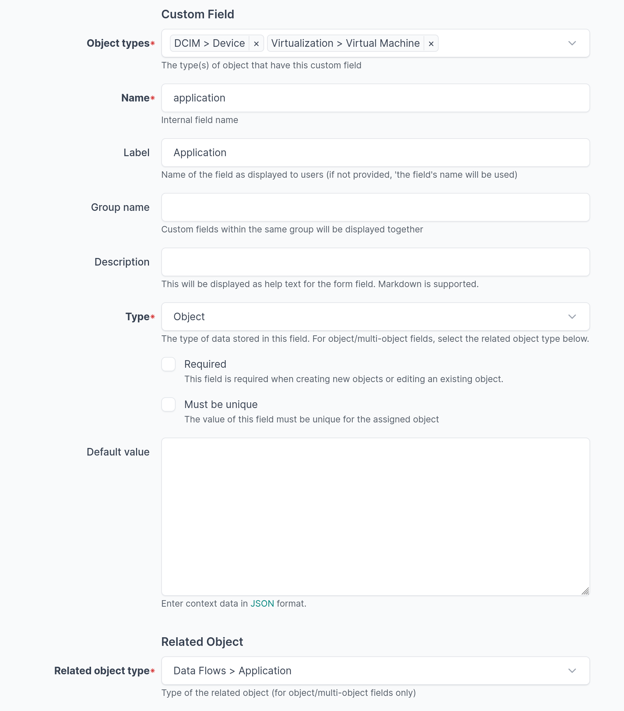

# Quick Start

This tutorial should let you discover how to use the plugin.

If you have not installed it yet, you should go to the [installation and configuration](installation-configuration.md) page first.

If you want a more general explanation of the models used by the plugin, head to the [data model](data-model.md) page.

## Scenario

In this tutorial, we want to document the data flows of two applications:

* Acme Inc, a business application composed of a frontend, a backend and a database.
* Zabbix, a support application that monitors our servers, our routers and our Acme Inc application.

Here is what the dataflows of the Acme Inc. application look like.


## Basic example

Let's start by documenting the two data flow below:

* The 3 frontend servers of Acme talk with the API exposed on the backend server
* Both the frontend servers and the backend servers communicate with the database server.

There are two mandatory objects to do that: the Object Aliases and the Data Flows.

### Object Aliases

First, go the bottom of the NetBox navigation menu to find the Data Flow plugin, and select *Object Aliases* under the *Data Flows* section, and click on "Add" to create a new alias.


Think of an **Object Alias** as a reusable group of IP addresses, ranges or prefixes that we can use as source and/or destination in many data flows. You can have more information in the [data model](data-model.md).

Our Object Aliases can contain any number of the following native NetBox objects:

* An IP Address (and implicitly the device, virtual machine or network interface associated to it)
* An IP Range
* A Prefix

> [!NOTE]
> The reason why it is not possible to use a Service object is because they represent a TCP/UDP/SCTP listener. Using them as a source for the data flow does not make sense, and because they are limited to these three protocols.
> There are also technical limitations as explained in the [data model](data-model.md).

Let's create three Object Aliases:

| Name                  | Description                   |
| --------------------- | ----------------------------- |
| acme_frontend         | Frontend webservers for Acme  |
| acme_backend          | Backend servers for Acme      |
| acme_database         | Database servers for Acme     |

When you create or edit an object alias, you can link any IP Address, IP Range or Prefix. Zou can use the filter functions to search which addresses need to be added.



Once created, your alias will look like that:


Let's repeat the same process for 'acme_backend' and 'acme_database'.



> [!TIP]
> You can leave the object alias empty if what is represents is not documented in your NetBox instance. For example, an alias named "Internet" could be used to represent any external IP address for data flows ingressing or egressing your network.

### Data Flows

Now that we have object aliases, we can create data flows. In the NetBox navigation menu, select *Data Flows* under the *Data Flows* section, and click on "Add" to create a new data flow.

For the plugin, a data flow is a network connection between some sources and some destinations (another set of object aliases), using a specific protocol:

* The sources are zero, one or more object aliases
* The destinations are also zero, one or more (potentially different) object aliases
* The protocol can be Any/ICMP/TCP/UDP/TCP+UDP/SCTP
* There can be a list of source and destination ports (by default, any port)
* The data flow can be marked as enabled or disabled.

> [!NOTE]
> The data flow can have an optional application and data flow group, which are explained later in the tutorial.

> [!TIP]
> By convention, if zero object aliases are specified as source (or as destination), this is interpreted (and displayed) as "Any". Similarly, if no source or destination ports are defined, this is interpreted as "Any".

> [!TIP]
> You can change the list of available protocols in the configuration. Check [the Protocol Choices section](installation-configuration.md#protocol-choices) in the configuration documenation for details.

In our example, the frontend servers communicates with the API exposed on port TCP 8443 of the backend servers. We don't need to specify a source port (interpreted as Any port).


Similarly, for the communications with the database servers, but here we have two sources.


## Complete example

Now that we have created two data flows, let's go back and make containers for them before creating the rest.

The plugin uses **Applications** and **Application Roles** to group data flows based on their purposes. Both models are optional, but recommended.

### Application Roles

Go to the bottom of the NetBox navigation menu to find the Data Flow plugin, and select *Application Roles* under the *Applications* section.

Here, you can create two Application Roles, which represent the category of applications, such as business or support, critical or not, external facing, etc., depending on your needs. In our example:

| Name                  |
| --------------------- |
| Business applications |
| Support applications  |

Application Roles have:

* A mandatory name and slug
* An optional description



### Applications

Go to the *Applications* list under the *Applications* section.

You can now create our two Applications. An application is a logical container for our data flows, which identify their purpose: *we have that data flow in our network because of that application*.

Applications can have:

* A mandatory name
* An optional application role
* Optional description and comments
* Optional contacts in the Contacts tab.

| Name                  | Application role
| --------------------- | --------------------- |
| Acme Inc. website     | Business applications |
| Zabbix                | Support applications  |


Once created, you will be able to see all the data flows related to an application in its detail page.



### Data Flow Groups

Application are used to describe the reason why a data flow exists, however it is often useful to regroup the data flows according to other criteria (e.g.: they are the same flow, but for different applications).

**Data Flow Groups** are made to be just that: arbitrary groups. They can form a hierarchy of groups (similar to the hierarchy of sites in NetBox) and they can also be associated to an application. However, a data flow can only belong to one direct group (and indirectly to all the ancestors of that group).

A group can contain data flows associated with several applications.

Depending on your needs, you can have:

* A group containing all the data flows in a DMZ, regardless of their applications
* A group containing all the data flows related to the backend of a specific application
* The same group contained in a more generic group containing all the data flows of that application
* ...

In our example, we will create the following hierarchy of groups:

* Acme Inc. data flows: all the data flows of that application
  * Acme Inc. external access: data flows related to user access to the frontend
  * Acme Inc. backend access: data flows related to user access to the backend
  * Acme Inc. inter-server communications
* Infrastructure management data flows
  * Zabbix application monitoring
  * Zabbix infrastructure monitoring
  * Zabbix network discovery

Data Flow Groups can have:

* A mandatory name and slug
* A mandatory status
* An optional application
* An optional parent group (to form the hierarchy)
* Optional description and comments

> [!TIP]
> If a data flow group is disabled, all its child groups and all the data flows they contain are also considered disabled. This allow to quickly switch on or off data flows based on the groups.



> [!NOTE]
> In this example, we have disabled the group "Acme Inc. external access".

The detail page of a group will list:

* Its child groups
* The data flows it directly contains
* The data flows all its children contain


### Object Aliases

Now, we can create the other Object Aliases that we need, such as the network ranges containing the endpoints of our business users, the Zabbix servers and the prefixes where we have the servers to be monitored.


> [!TIP]
> Do you need to enforce a naming convention for your object aliases, data flows or groups? Check [the Nomenclature section in this page](installation-configuration.md#nomenclature) for details.

### Data flows

Let's create the remaining data flows.


> [!NOTE]
> Because we have disabled the group "Acme Inc. external access", the data flow it contains is marked as *Disabled (Inherited)*.
> The data flow "Internal access to Acme backend API" also appears *Disabled*: its groups are all enabled, but the data flow was disabled directy.

The "Targets" tab in the data flow's detailed view can be used to resolve the object aliases and display the list of all IP address, ranges and prefixes in this data flow.


### Tab views

The plugin adds tab views in the native objects that are the source or the destination of a data flow.

In the example below, the device is part of one object alias and in the destination of our data flows related to Zabbix.


And this VM is one of the frontend servers:


This tab is automatically displayed when an object is member of at least one object alias. It is displayed for:

* IP Addresses
* IP Ranges
* Prefixes
* Devices with at least one IP Address assigned to one interface
* Virtual machines with at least one IP Address assigned to one interface

> [!WARNING]
> The tab lists all the object aliases and dataflows where the object is explicitly listed. It does not detect when a prefix or range would implicitly include an IP address, a smaller range or a child prefix.

## Application-related Objects

If you want, you can use a custom field to document which application other assets belong to. First, create a custom field (in the Customization section of NetBox) and link it to any object types you want (devices and virtual machines in this example).

The custom field must have the following settings:

* Name: any internal name you want (lowercase letters and underscores only), you will use it to configure the plugin in the next step.
* Label: the field name that will be displayed when editing a device or virtual machine.
* Type: it must be `Object` (if assets can belong to at most one application) or `Multiple objects` (if you allow an asset to have multiple applications).
* Related object type: select `Data Flows > Application`.



Then, edit NetBox's `configuration.py` and add a `PLUGIN_CONFIG`:

```python
# Add in: /opt/netbox/netbox/netbox/configuration.py

PLUGINS_CONFIG = {
    'netbox_data_flows': {
        # Use a Custom Field to identify objects linked to an application
        'application_custom_field': "application",
    }
}
```
After restarting NetBox, you can now link assets to your applications. In the application page, you will see the number of related objects, and clicking on each line will list the objects:


